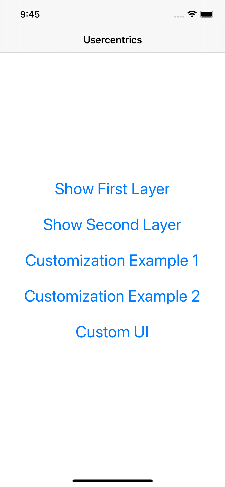
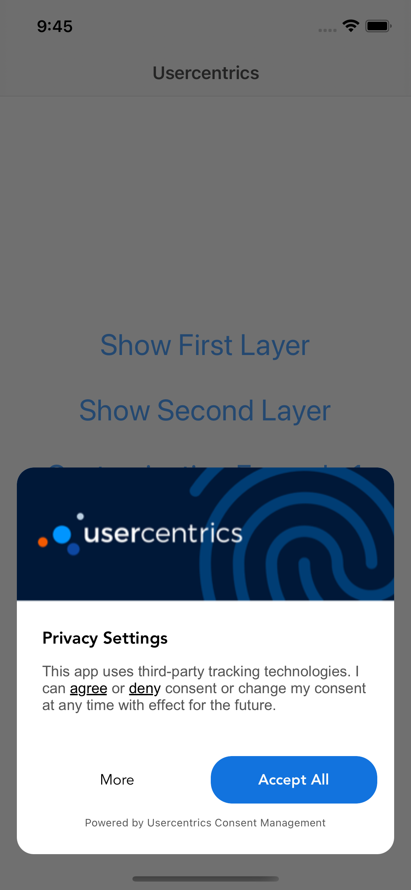
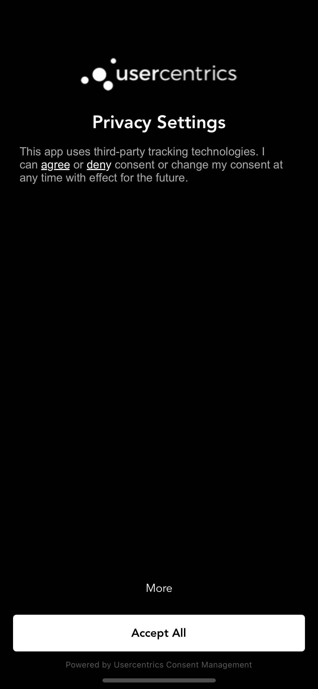
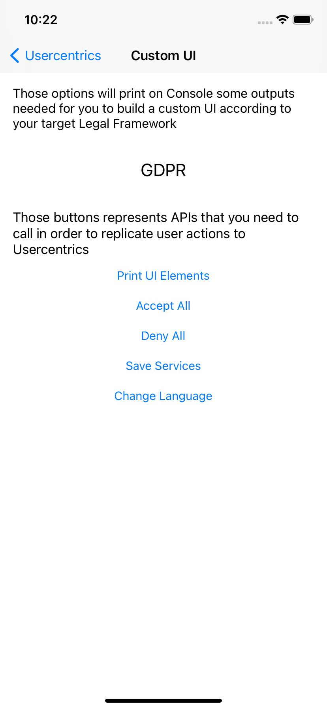

# Usercentrics SDK for iOS - Quickstart

The goal of this repository is to show how to use Usercentrics SDK inside of an iOS application.

# Already a customer?

In case you wish to report an issue, we provide a [dedicated page](https://usercentricssupport.zendesk.com/hc/en-us/requests/new) specifically for this purpose. By accessing the provided link and submitting a ticket our team will address your concerns with the utmost efficiency, ensuring a prompt resolution.

Instructions
------------

* **Step 1:** Clone the repository

* **Step 2:** Open Xcode and import the project

* **Step 3:** Run

Result
------------

After running the app you should see a screen like this:

Customization Examples
------------

These examples will help you understand how the customization API works.

- [Example 1](https://github.com/Usercentrics/ios-sample/tree/main/iOSSampleApp/ViewControllers/Main/FirstLayerCustomizations.swift#L5):
  

  
- [Example 2](https://github.com/Usercentrics/ios-sample/tree/main/iOSSampleApp/ViewControllers/Main/FirstLayerCustomizations.swift#L36):
  

Custom UI
------------

This screen will help you understand how you can [build your own CMP](https://docs.usercentrics.com/cmp_in_app_sdk/latest/collect_consent/build_own_cmp/).
We recommend you to interact with all buttons displayed, check your Console and don't forget to see the code behind.

Learn more
------------

- For a full overview of our SDK, please see our dedicated [documentation](https://docs.usercentrics.com/cmp_in_app_sdk/latest/).
- For more information and products, check out our [website](https://usercentrics.com).

